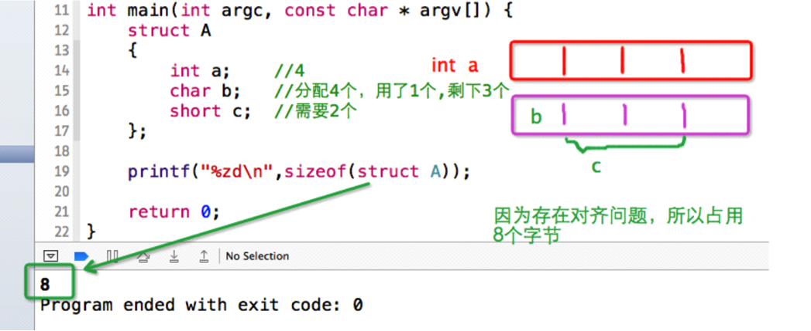
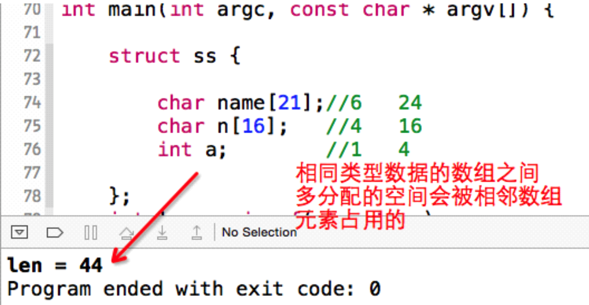
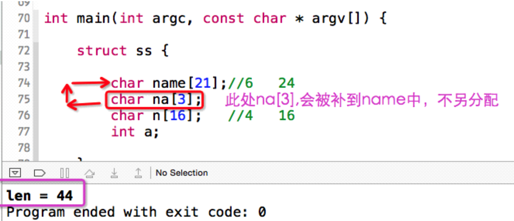
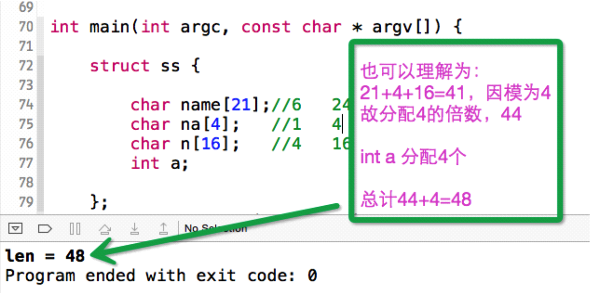
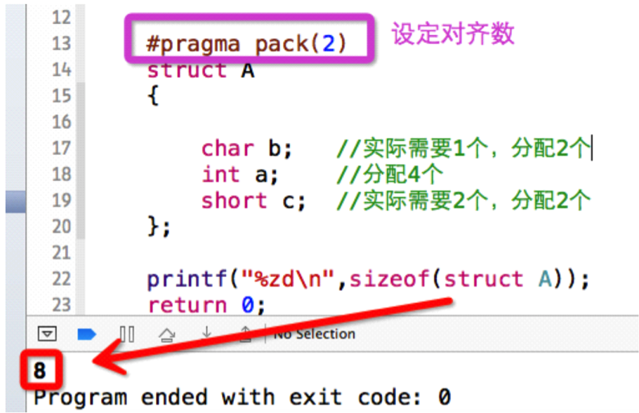

# 06-结构体内存分析
##本小节知识点:
1. 【理解】结构体存储原理
2. 【了解】结构体数据成员对齐的意义
3. 【理解】结构体变量占用存储空间大小
4. 【了解】练习

---

##1.结构体存储原理
- 结构体类型与int\char\double一样,编译系统并不对它分配内存空间。只用通过他来定义变量的时候才会为这个变量分配存储空间

- 内存是以字节为单位编号,但一些硬件平台对某些特定类型的数据只能从某些特定地址开始, 比如从偶地址开始。若不按照适合其平台的要求对数据存放进行对齐,会影响到效率。 因此,在内存中,各类型的数据是按照一定的规则在内存中存放的,这就是对齐问题。

- **结构体占用的内存空间是每个成员占用的字节数之和(考虑对齐问题)。**
---


##2.结构体数据成员对齐的意义
- 许多实际的计算机系统对基本类型数据在内存中存放的位置有限制,它们会要求这些数据的起始地址的值是 某个数k的倍数,这就是所谓的内存对齐,而这个k则被称为该数据类型的对齐模数(alignment modulus)。

- 这种强制的要求一来简化了处理器与内存之间传输系统的设计,二来可以􏰀升读取数据的速度。比如这么一 种处理器,它每次读写内存的时候都从某个8倍数的地址开始,一次读出或写入8个字节的数据,假如软件能 保证double类型的数据都从8倍数地址开始,那么读或写一个double类型数据就只需要一次内存操作。否 则,我们就可能需要两次内存操作才能完成这个动作,因为数据或许恰好横跨在两个符合对齐要求的8字节 内存块上。

---

##3.结构体变量占用存储空间大小
- 对齐模式
    + 可以理解为每一次分配多少个字节存储空间，可以通过#pragma pack 指定
    + 默认情况下，对齐的模数是占用存储空间最大的成员所占用的字节数

- 计算方法
    + 1)将结构体内所有数据成员的长度值相加,记为sum_a;
    + 2)将各数据成员为了内存对齐,按各自对齐模数而填充的字节数累加到和sum_a上,记为sum_b。 对齐模数是#pragma pack指定的数值以及该数据成员自身长度中数值较小者。该数据相对起始位 置应该是对齐模式的整数倍;
    + 3)将和sum_b向结构体模数对齐,该模数是#pragma pac指定的数值和结构体内部最大的基本数据 类型成员长度中数值较小者。```结构体的长度应该是该模数的整数倍。```

- 所谓“对齐在N上”,指定是“存放起始地址%N=0”

```
struct A
{
    int a; //4
    char b; //分配4个,用了1个,剩下3个
    short c; //需要2个
};
printf("%zd\n",sizeof(struct A));
```




- 注意结构体中有数组的问题




- 使用pragma pack(指定的对其长度) 可以指定内存对齐长度


---

##4.练习
- 分析一下结构体占用的字节数

```
struct A
{
    int my_test_a;
    char my_test_b;
    double my_struct_a;
    int my_struct_b;
    char my_struct_c;
}
```
- 如果强制设置对齐模数为2 #pragma pack(2),占用多少个字节?

---
