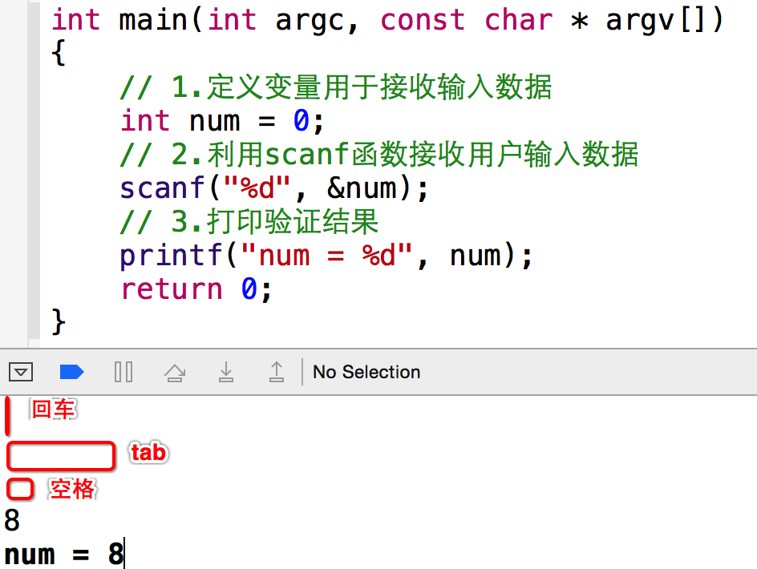
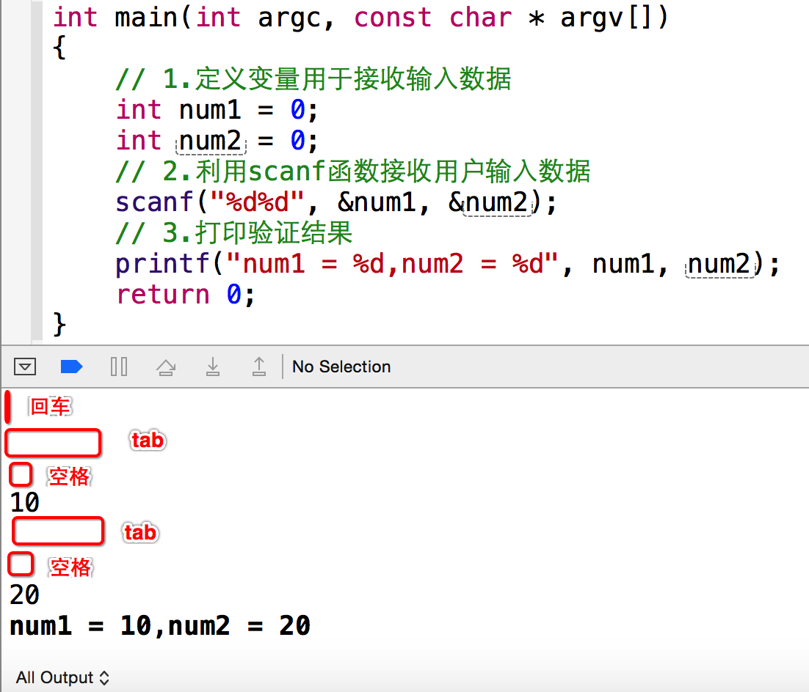
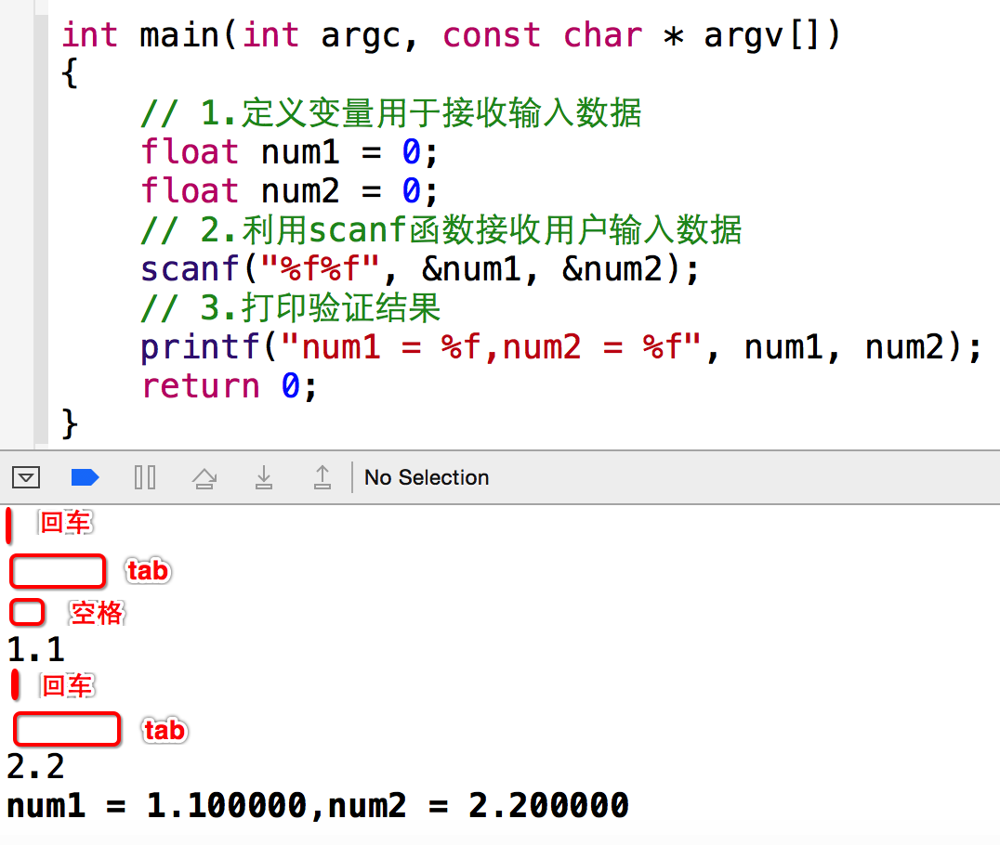
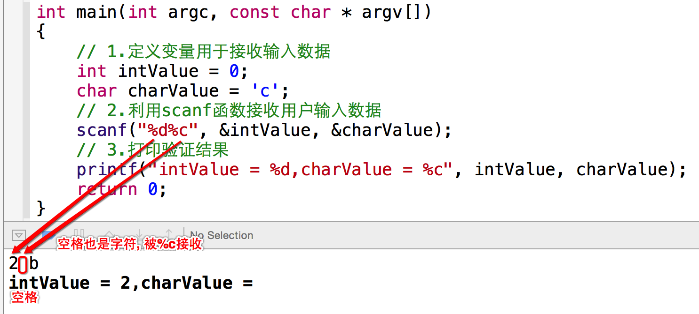
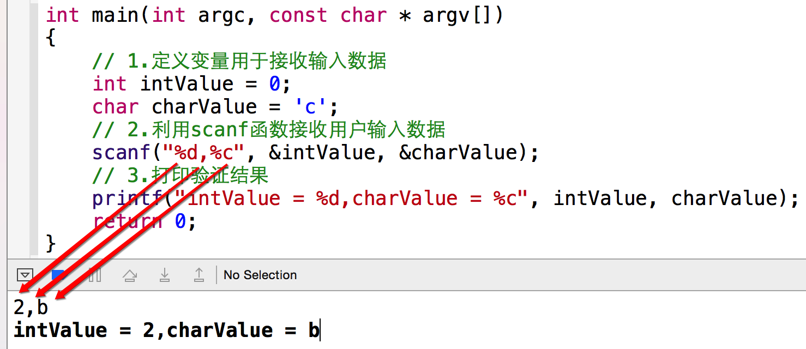
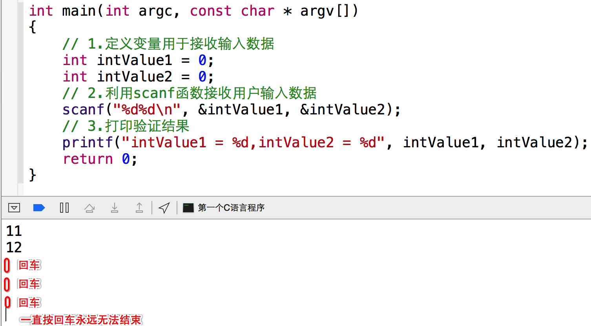
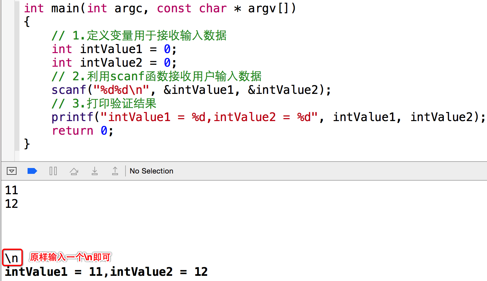

# Scanf函数注意事项
##本小节知识点:
1. 【掌握】scanf使用注意事项

---

##1.scanf使用注意事项
- 如果在输入时,输入了多个空格、回车、Tab都会被系统忽略的
    + 
- 如果要获取的内容是多个整数,中间输入了多个空格、回车、Tab都会被系统忽略
    + 
- 如果要获取的内容是多个实型,中间输入了多个空格、回车、Tab都会被系统忽略
    + 
- 非法的格式输入,得不到想要的结果
    + 
- 混合整形和字符型数据接收
    + 当整形的数和字符混合输入时,要避免“空格” 添麻烦
    + 为防止混合输入空格造成的错误,可以通过添加普通的分隔符解决
        * 

- 关于使用"\n"的问题
    + scanf函数当遇到回车的时候，会结束执行
    + 
    + 所以在scanf中，尽量不要使用 \n
    + 如果在scanf中使用了\n, 需要原样输入"\n"
    + 

---

