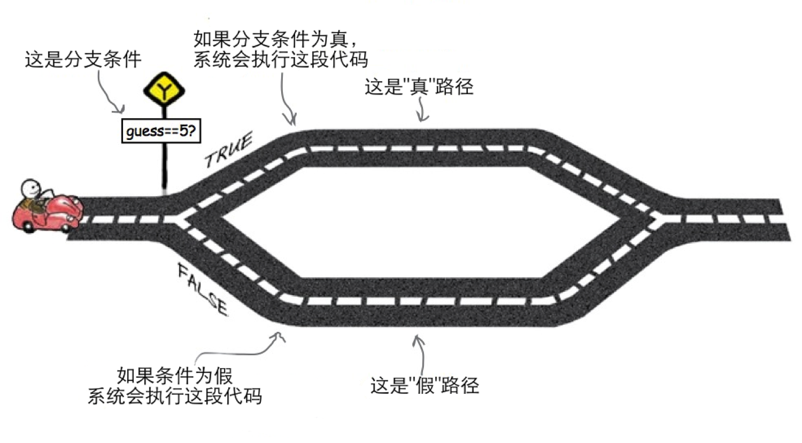

# 选择结构-if基本概念
##本小节知识点:
1. 【掌握】if第一种形式
2. 【掌握】if第二种形式
3. 【掌握】if第三种形式
4. 【掌握】if第四种形式

---

##1.if第一种形式
- 表示如果表达式为真,执行语句块1,否则不执行。
```
if(表达式)
{
    语句块1
}
后续语句;
```
- 示例:
```
if(age > 18)
{
    printf("开网卡");
}
```
---

##2.if第二种形式
- 当条件表达式为真的时候会执行if后面的第一条语句
- 注意点：在以后开发中尽量不要写使用该格式
```
 if (条件表达式)
    语句1；
```
- 示例:
```
if(age > 18)
    printf("开网卡");
```
---

##3.if第三种形式
- 如果表达式为真,则执行语句块1,否则执行语句块2
```
if(表达式)
{
    语句块1
}else{
    语句块2
}
后续语句;
```
- 示例:
```
if(age > 18)
{
    printf("开网卡");
}else{
    printf("喊你妈来");
}
```



---

##4.if第四种形式
- 如果表达式1为真,则执行语句块1,否则判断表达式2,如果为真执行语句块2,否则再判断 表达式3,如果真执行语句块3, 当表达式1、2、3都不满足,会执行最后一个else语句。
```
if(表达式1)
{
    语句块1
}else if(表达式2){
    语句块2
}else if(表达式3){
    语句块3
}else{
    语句块4
}
后续语句;
```
- 示例:
```
if(age>18)
{
    printf("给网卡");
}else if(age>25){
    printf("给名片");
}else if(age>40){
    printf("给房卡");
}else{
    printf("给好人卡");
}
```
-  特点：
    + 1.这么多大括号中只有一个大括号中的内容会被执行
    + 2.当执行到后面条件的时候证明前面的条件不满足


##6.if嵌套
- if语句可以嵌套使用
- 示例:
```
    int num = 8;
    if (num > 5)
    {
        if(num<10)
        {
            printf("一个5~10之间的数")
        }
    }
```

- 练习

---
